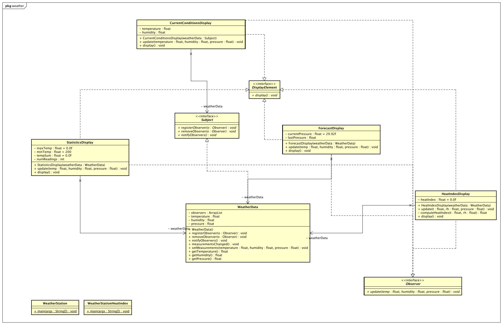

# "*Observer - WeatherData*"

## Aufgabenstellung
Die detaillierte [Aufgabenstellung](TASK.md) beschreibt die notwendigen Schritte zur Realisierung.

## Implementierung
### Gradle Run
Als erstens haben wir die Main Klasse in build.gradle definiert.
### Astah
Dann haben wir aus den Klassen in Astah ein Klassendiagramm generiert.

### Push->Pull
Um von Push zu Pull zu ändern, 
+ Parameter von update() entfernen
+ Bei WeatherData Parameter von update() entfernen
+ die Display Klassen updaten damit sie sich nur das holen was sie brauchen

#### Vorteile von Pull
+ niedriger Netzwerkaufwand und höhere Flexibilität, da die Observer nur die Daten pullen die sie brauchen 
+ Interface Parameter müssen nicht immer angepasst werden
### Nachteile von Pull
+ 2mal anfragen

## Quellen
https://softwareengineering.stackexchange.com/questions/253398/the-observer-pattern-using-the-pulling-mechanism